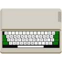
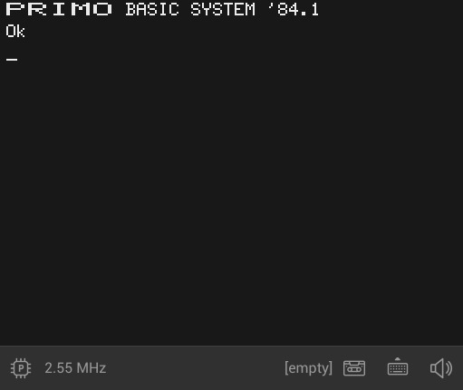

<h1 align="center">
  
  <br>
  <b>PrimGO - PRIMO Emulator</b>
</h1>
<p align="center">
  PrimGO is a multi-platform PRIMO emulator written in Go using the <a href="https://ebitengine.org/">Ebitengine</a> game engine.
  <br><br>
  <a href="https://no1msd.github.io/primgo/"><b>Try it out online!</b></a>
  <br><br>
  
</p>

## What is PRIMO?
PRIMO is an 8-bit home computer developed in 1984 by the Hungarian research institute [SZTAKI](https://sztaki.hun-ren.hu/en). It's using an East German Z80-clone CPU, it was sold with either 16K, 32K or 48K RAM, and it supports a 256x192 monochrome graphic display. Between 1984 and 1986 around 7000 units were built, and it was only sold in the Hungarian market. [Find out more here (in Hungarian).](http://primo.homeserver.hu/)

## Features
- Z80 CPU emulation based on [koron-go/z80](https://github.com/koron-go/z80)
- Sound emulation
- Loading [PTP tape files](http://primo.homeserver.hu/html/konvertfajlok.html)
- Variable CPU frequency
- Virtual keyboard
- A64, B64 and C64 versions

Currently there is no support for:
- Loading PRI files
- Saving in any format
- Joysticks
- Other peripherals

## Usage
### CPU Frequency
The label in the bottom left corner is the current measured CPU frequency. You can change the target by clicking on the CPU icon next to it. There are 3 modes:
- **P**: 2.5 MHz, the original PRIMO CPU frequency
- **S**: 3.5 MHz, ZX Spectrum CPU frequency for ported games
- **T**: 3.75 MHz, the PRIMO "Turbo" mode

### Display
You can enter or exit full-screen mode by pressing F11. You can also change the scaling mode from the default to only upscale by whole numbers for a sharper image by clicking the invisible button in the top right corner.

### Keyboard
You can open the on-screen keyboard by clicking on the keyboard icon in the lower right corner. On the physical keyboard special keys are mapped to the following:
- **Soft reset**: F1
- **Hard reset**: Ctrl+Esc
- **BRK**: Tab
- **CLS**: Home
- **<, >**: Delete
- **', \***: Insert

### Tapes
PrimGO supports loading PTP tape files by patching the PRIMO ROM to read from the selected file instead of an actual tape player. You can select a tape by clicking on the cassette icon in the lower right corner. The label next to it shows the name of the currently selected tape. There are a few built-in tapes in the emulator, mostly from the original demo cassette that came with the computer, and a few other programs developed exclusively for the PRIMO. 

After selecting a tape you can load the program into memory by typing the following into the emulator:
```
LOAD
```
Some programs will start automatically, some should be started manually:
```
RUN
```

## Building
You can find instructions on how to install dependencies on various platforms in the [Ebitengine documentation](https://ebitengine.org/en/documents/install.html). If everything is installed you can build the PrimGO executable simply by running the following command in the source directory:
```
$ make
```

Or to build the WebAssembly version:
```
$ make web
```

## License

PrimGO is licensed under the [MIT license](https://github.com/no1msd/primgo/blob/main/LICENSE).
